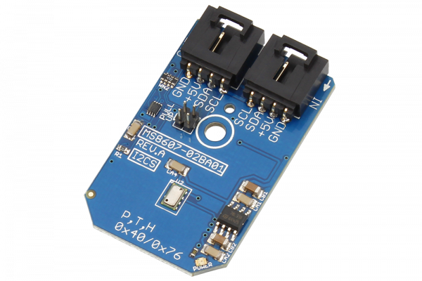

# MS8607-02BA01

The MS8607 is the novel digital combination sensor of MEAS providing 3 environmental physical measurements all-in-one: pressure, humidity and temperature (PHT).
This Device is available from www.ncd.io 

[SKU: MS8607-02BA01_I2CS]

(https://store.ncd.io/product/mmc2460mt-%C2%B16-gauss-low-noise-2-axis-magnetic-sensor-i2c-mini-module/)
This Sample code can be used with Arduino.

Hardware needed to interface MS8607-02BA01 sensor with Arduino

1. <a href="https://store.ncd.io/product/i2c-shield-for-arduino-nano/">Arduino Nano</a>

2. <a href="https://store.ncd.io/product/i2c-shield-for-arduino-micro-with-i2c-expansion-port/">Arduino Micro</a>

3. <a href="https://store.ncd.io/product/i2c-shield-for-arduino-uno/">Arduino uno</a>

4. <a href="https://store.ncd.io/product/dual-i2c-shield-for-arduino-due-with-modular-communications-interface/">Arduino Due</a>

5. <a href="https://store.ncd.io/product/mmc2460mt-%C2%B16-gauss-low-noise-2-axis-magnetic-sensor-i2c-mini-module/">MS8607-02BA01 24-Bit Altimeter 10 to 1200 mbar 20cm Altitude Sensor</a>

6. <a href="https://store.ncd.io/product/i%C2%B2c-cable/">I2C Cable</a>

MS8607-02BA01:

The MS8607 is the novel digital combination sensor of MEAS providing 3 environmental physical measurements all-in-one: pressure, humidity and temperature (PHT).

Applications:

• HVAC applications

• Weather station

• Printers and

• Home Appliances.

How to Use the MS8607-02BA01 Arduino Library

The MS8607-02BA01 has a number of settings, which can be configured based on user requirements.
          
1.Initial pressure seting:The following command is used to set the initial pressure of sensor..

            ms.setinitiatePressure(D1_OSR_256);             // Convert D1 (OSR=256)
            
2.Initial Temperature setting:The following command is used to set the initial temperature of sensor.

             ms.setinitiateTemperature(D2_OSR_256);          // Convert D2 (OSR=256)
             
3.Resolution setting:The following command is used to set the resolution of MS8607-02BA01 sensor.             
             
            ms.setResolution(D3_OSR_4096);                  // Resolution (D3): Highest, OSR: 4096
            
4.Voltage setting:The following command is used to set the voltage.

            ms.setVoltage(VOLTAGE_OK);                      // VDD OK  
            
5.Heater status:The following command is used to DISABLE the heater.

            ms.setHeaterStatus(HEATER_DISABLE);          // On-chip Heater Disable
            
6.Humidity mode:The following command is used to measure the humidity in NO HOLD Master mode.           
            
             ms.setHumidityMode(HUMIDITY_NO_HOLD);           // Measure Humidity, No Hold Master Mode
            
            
